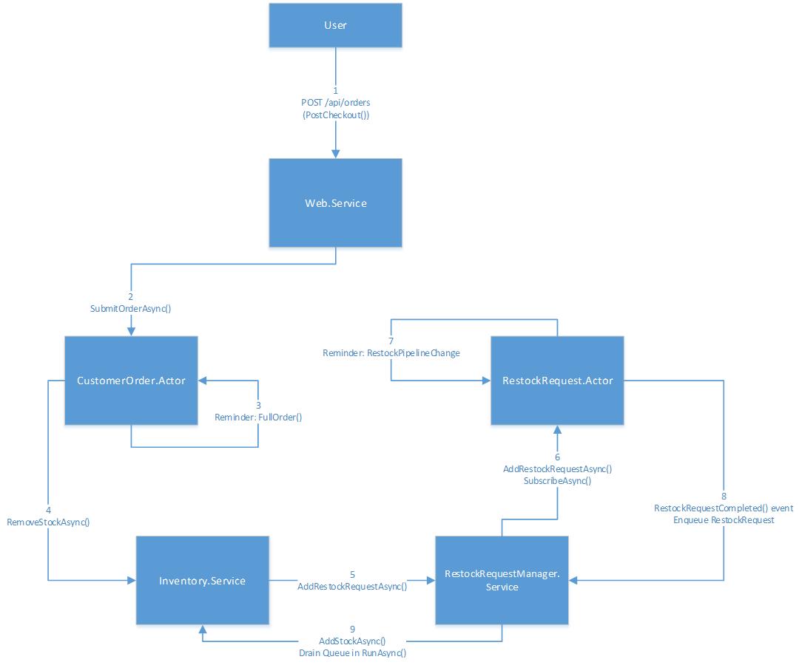

# Application architecture

The application is composed of individual services to perform the major functions of the application:

- Web Service
	- A stateless front-end service that hosts the web UI and HTTP API for interacting with the store.
- Customer Order Actor
	- An actor-based service that handles customer orders. A stateful actor is activated for each new order that's placed. The actor represents the lifetime of the customer order, from placement to fulfillment.
- Inventory Service
	- A stateful service that maintains the store's inventory. This service is partitioned, where each partition of the service holds a subset of the store's entire inventory. With a large number of partitions, this service can scale out to meet data capacity and inventory request throughput.
- RestockRequest Actor
	- A stateful actor that manages the lifetime of a restock request from the inventory service. Each time the inventory runs low on stock for an item, makes a request to refill the inventory. The restock request actor itself would send a request to a supplier for more items, however this is simply simulated within the actor.
- RestockRequest Manager
	- This is a stateful service that manages requests from the inventory service for item restocking. It logs restock requests made by the Inventory Service and activates a RestockRequest Actor to fulfill the requst. It then receives notifications from the actors when a restock request has been fulfilled. These notifications are placed in a ReliableQueue as they come in. The notifications are periodically dequeued and sent back to the Inventory Service.

# Data flow

When a user makes a purchase, data flows the through the system as follows:

1. Client sends HTTP POST to /api/orders with order in JSON payload: 

	[{"ItemId":"1d6abc91-ebe7-41ff-b868-4086501903fc","Quantity":1},{"ItemId":"a833f7d0-2f76-4c9f-9353-8c728252da4a","Quantity":2}]
	
	Response from service is a tracking ID: 
	68bf3f53-dc74-4ef9-8f60-89d68508247b
 
2. Web Service creates a new Actor (by specifying a new ActorId) to track the order by calling SubmitOrderAsync() on the Customer Order Actor service.

3. Customer Order Actor saves the order in its state, registers a reminder for itself to complete the order, and returns to the caller. Order processing has a number of steps and may need to retry in case of failure, thus the reminder serves as a queued work item within the Actor in order to prioritize saving the order reliably and returning to the caller as quickly as possible.

4. Customer Order Actor processes the order by requesting stock for the order to be removed from the Inventory Service. If there is not enough stock available to fulfill the order, the actor adds the back ordered items to its list of backordered state and registers another reminder on itself to try fulfilling the order again later. If this process completes successfully (either by completing the order or by tracking backorder items), the reminder for this method is removed, which has the effect of removing the queue work item. If at any point the method throws or the service crashes, the reminder will remain and will be executed again automatically to retry fulfilling the order. NOTE: the retry mechanism is not fully implemented yet.

5. Inventory Service checks to see if available stock is below the restock threshold after removing stock as requested by a CustomerOrder Actor. If the stock for a certain item is below the restock threshold and it's not already being reordered, it calls AddRestockRequestAsync on the Restock Request Manager.

6. When the Restock Request Manager receives a restock request, it creates a new Actor to track the request and adds the Actor to its own Reliable Dictionary so that it may query the restock request Actors later. Upon adding the Actor, it subscribes to event notifications from the Actor. This will be used later to notify the Restock Request Manager when the restock request is complete.

7. The Restock Request Actor registers a reminder on itself to go through the restock processing pipeline. This pipeline is normally where restocking logic would live, but currently it is simply faked by progressing through each step of restocking every time the reminder fires. When it reaches the last step in the pipeline, it signals the completed event (for which the Restock Request Manager is listening), and unregisters the reminder when that completes.

8. When the Restock Request Actor completes the restock request, it signals the complete event which sends the completed RestockRequest back to the Restock Request Manager. The Manager queues the completed Restock Request in a Reliable Queue for later processing and unsubscribes from receiving events from the Actor, which is now complete and will eventually be garbage-collected.

9. Restock Request Manager's RunAsync method periodically drains the queue of Restock Requests and sends those Restock Requests to the Inventory Service for restocking.
